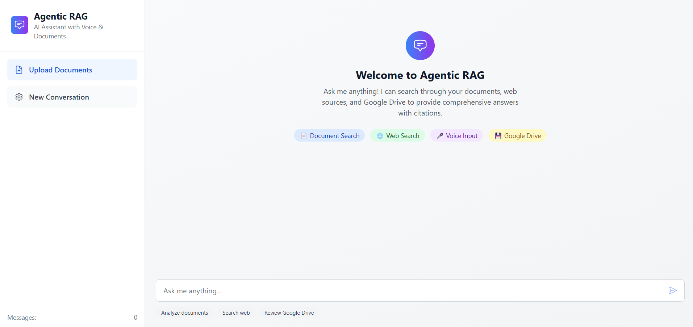

# 🤖 Agentic RAG System


A comprehensive Retrieval-Augmented Generation (RAG) system that combines voice input, multimodal document processing, and intelligent search capabilities across multiple sources. Built with FastAPI and Next.js, this system provides real-time AI-powered question answering with visual grounding and citation support.

## 🌟 Features

### 🎤 Voice Integration
- **Real-time Speech-to-Text**: Streaming voice input using Google Cloud Speech-to-Text
- **WebSocket-based Audio Processing**: Low-latency voice recognition with partial results
- **Multi-language Support**: Configurable language detection and transcription
- **Voice-enabled Chat Interface**: Natural conversation flow with voice commands

### 📚 Multimodal Document Processing
- **Advanced PDF Processing**: Extract text, images, charts, and tables from PDFs
- **Image Understanding**: AI-powered analysis of charts, diagrams, and visual content
- **OCR Integration**: Text extraction from scanned documents and images
- **Smart Chunking**: Intelligent text segmentation with context preservation
- **Visual Grounding**: Link answers to specific document images and pages

### 🔍 Intelligent Multi-Source Search
- **Local RAG System**: Vector-based document retrieval with ChromaDB
- **Web Search Integration**: Real-time web search via SERP API
- **Google Drive MCP**: Model Context Protocol integration for Drive documents
- **Parallel Search Execution**: Simultaneous queries across all sources
- **Smart Result Fusion**: Intelligent combination of results from multiple sources

### 📍 Citations & Transparency
- **Comprehensive Citations**: Detailed source attribution for every answer
- **Visual Citations**: Click-through access to source images and documents
- **Confidence Scoring**: Reliability indicators for each source
- **Source Traceability**: Full audit trail of information sources
- **Interactive Content Viewer**: In-app display of PDFs, images, and web content

### ⚡ Real-time Capabilities
- **WebSocket Communication**: Real-time chat and voice processing
- **Streaming Responses**: Progressive answer generation
- **Live Transcription**: Real-time speech-to-text with partial results
- **Concurrent Processing**: Parallel execution of search and generation tasks

## 🏗️ Architecture

```
┌─────────────────┐    ┌──────────────────┐    ┌─────────────────┐
│   Frontend      │    │    Backend       │    │   External      │
│   (Next.js)     │    │   (FastAPI)      │    │   Services      │
├─────────────────┤    ├──────────────────┤    ├─────────────────┤
│ • Voice Input   │◄──►│ • STT Service    │    │ • Gemini/Claude │
│ • Chat UI       │    │ • RAG Engine     │◄──►│ • Google Drive  │
│ • Citations     │    │ • Web Search     │    │ • SERP API      │
│ • Image Display │    │ • Document Proc. │    │ • ChromaDB      │
└─────────────────┘    └──────────────────┘    └─────────────────┘
```

## 🛠️ Technology Stack

### Backend
- **Framework**: FastAPI 0.104+ with async/await support
- **AI Providers**: Google Gemini 1.5 Pro, Anthropic Claude 3 Sonnet
- **Vector Database**: ChromaDB for embedding storage and retrieval
- **Speech Processing**: Google Cloud Speech-to-Text API
- **Document Processing**: PyPDF2, Pillow, pytesseract for OCR
- **Search Integration**: SERP API for web search, Google Drive API
- **WebSocket**: Real-time communication with connection management
- **Authentication**: OAuth 2.0 for Google services

### Frontend
- **Framework**: Next.js 14 with App Router
- **Language**: TypeScript for type safety
- **UI Library**: React 18 with Tailwind CSS
- **State Management**: Zustand for client state
- **Audio Processing**: Web Audio API with WebRTC
- **Real-time**: WebSocket client with auto-reconnection
- **Testing**: Jest and React Testing Library

### AI & ML
- **Embeddings**: sentence-transformers/all-MiniLM-L6-v2
- **Vector Search**: Similarity search with configurable thresholds
- **Multimodal AI**: Vision models for image understanding
- **Text Generation**: Context-aware response generation
- **Confidence Scoring**: Relevance and reliability metrics

## 🚀 Installation & Setup

### Prerequisites

- **Python 3.9+** (3.11 recommended)
- **Node.js 18+** with npm/yarn
- **Google Cloud Account** (for Speech-to-Text)
- **AI Provider Account** (Gemini or Claude)

### 1. Clone Repository

```bash
git clone <repository-url>
cd agnt
```

### 2. Backend Setup

#### Install Dependencies
```bash
cd backend
pip install -r requirements.txt
```

#### Configure Environment
```bash
cp env.example .env
# Edit .env with your configuration (see Configuration section)
```

#### Set up Google Cloud Service Account
1. Create a project in [Google Cloud Console](https://console.cloud.google.com)
2. Enable Speech-to-Text API and Drive API
3. Create a service account and download the JSON key
4. Set `GOOGLE_CLOUD_SERVICE_ACCOUNT_PATH` in your `.env` file

#### Initialize Database
```bash
# ChromaDB will be initialized automatically on first run
# Data will be stored in ./chroma_db/ directory
```

### 3. Frontend Setup

#### Install Dependencies
```bash
cd frontend
npm install
# or
yarn install
```

#### Configure Environment
```bash
# Create .env.local file
echo "NEXT_PUBLIC_API_URL=http://localhost:8000" > .env.local
echo "NEXT_PUBLIC_WS_URL=ws://localhost:8000" >> .env.local
```

### 4. Running the Application

#### Start Backend Server
```bash
cd backend
uvicorn main:app --host 0.0.0.0 --port 8000 --reload
```

#### Start Frontend Development Server
```bash
cd frontend
npm run dev
# or
yarn dev
```

#### Access the Application
- **Frontend**: http://localhost:3000
- **Backend API Docs**: http://localhost:8000/docs
- **Backend Health Check**: http://localhost:8000/health

## ⚙️ Configuration

### Environment Variables

#### Core AI Configuration
```bash
# Choose your AI provider
AI_PROVIDER=claude  # or "gemini"

# API Keys (get one based on your provider choice)
CLAUDE_API_KEY=your_claude_api_key
GEMINI_API_KEY=your_gemini_api_key
```

#### Speech-to-Text Setup
```bash
# Google Cloud Speech-to-Text (required for voice features)
GOOGLE_CLOUD_SERVICE_ACCOUNT_PATH=/path/to/service-account.json
STT_PROVIDER=google
GOOGLE_SPEECH_MODEL=latest_long
```

#### Search Integration (Optional)
```bash
# Web Search (choose one)
SERP_API_KEY=your_serp_api_key          # Recommended
GOOGLE_API_KEY=your_google_api_key      # Alternative

# Google Drive Integration
GOOGLE_DRIVE_CLIENT_ID=your_client_id
GOOGLE_DRIVE_CLIENT_SECRET=your_client_secret
```

#### Advanced Settings
```bash
# Vector Database
CHROMA_PERSIST_DIRECTORY=./chroma_db
EMBEDDING_MODEL=sentence-transformers/all-MiniLM-L6-v2

# Performance Tuning
MAX_SEARCH_RESULTS=10
SIMILARITY_THRESHOLD=0.7
MAX_TOKENS_PER_CHUNK=1000
CHUNK_OVERLAP=200
MAX_CONCURRENT_REQUESTS=100

# Security
CORS_ORIGINS=http://localhost:3000,http://127.0.0.1:3000
SECRET_KEY=your-secret-key-change-in-production
RATE_LIMIT_PER_MINUTE=60

# Feature Flags
ENABLE_WEB_SEARCH=true
ENABLE_GOOGLE_DRIVE=true
ENABLE_VOICE_INPUT=true
ENABLE_IMAGE_ANALYSIS=true
```

### Model Configuration

#### AI Provider Selection
- **Claude**: Better reasoning, more conservative responses
- **Gemini**: Faster processing, better multimodal understanding

#### Model Choices
```bash
# Gemini Models
GEMINI_CHAT_MODEL=gemini-1.5-pro
GEMINI_VISION_MODEL=gemini-1.5-pro-vision

# Claude Models  
CLAUDE_CHAT_MODEL=claude-3-sonnet-20240229
CLAUDE_VISION_MODEL=claude-3-sonnet-20240229
```

## 📖 API Documentation

### Core Endpoints

#### Health Check
```http
GET /health
```
Returns system status and service availability.

#### Document Upload
```http
POST /upload
Content-Type: multipart/form-data

file: <PDF file>
```
Upload and process a PDF document with image extraction.

**Response:**
```json
{
  "success": true,
  "document_id": "uuid",
  "filename": "document.pdf",
  "pages_processed": 10,
  "images_extracted": 5,
  "text_chunks": 25,
  "processing_time_ms": 1500
}
```

#### Query System
```http
POST /query
Content-Type: application/json

{
  "query": "What is the main conclusion of the research?",
  "num_results": 5,
  "include_web_search": true,
  "include_drive_search": true
}
```

**Response:**
```json
{
  "answer": "Based on the research findings...",
  "citations": [
    {
      "id": "cite_1",
      "source_type": "document",
      "citation_type": "text",
      "title": "Research Paper.pdf",
      "content": "The main conclusion shows...",
      "page_number": 15,
      "confidence_score": 0.95
    }
  ],
  "confidence_score": 0.87,
  "processing_time_ms": 2300
}
```

#### Citation Details
```http
GET /citation/{citation_id}
```
Retrieve full content and metadata for a specific citation.

### WebSocket Endpoints

#### Speech-to-Text
```javascript
const ws = new WebSocket('ws://localhost:8000/ws/stt');

// Send audio data
ws.send(audioBuffer);

// Receive transcription
ws.onmessage = (event) => {
  const result = JSON.parse(event.data);
  console.log(result.text, result.confidence);
};
```

#### Real-time Chat
```javascript
const ws = new WebSocket('ws://localhost:8000/ws/chat');

// Send message
ws.send(JSON.stringify({
  type: 'query',
  message: 'Hello, how can you help me?',
  session_id: 'session_123'
}));
```

### Frontend API Client

The frontend includes a comprehensive API client in `src/lib/api.ts`:

```typescript
import { QueryRequest, QueryResponse } from '@/types/api';

// Query the system
const response = await api.query({
  query: 'What is machine learning?',
  num_results: 5
});

// Upload document
const result = await api.uploadDocument(file);

// Get citation details
const citation = await api.getCitation(citationId);
```

## 🎯 Usage Examples

### Basic Text Query

1. Open the application at http://localhost:3000
2. Type your question in the chat input
3. View the AI-generated response with citations
4. Click citations to view source content

### Voice Query

1. Click the microphone icon in the chat interface
2. Speak your question clearly
3. Watch real-time transcription appear
4. Release to send the query
5. Receive voice-enabled response

### Document Upload & Analysis

1. Click the upload button or drag files into the interface
2. Select a PDF document (with images/charts)
3. Wait for processing to complete
4. Ask questions about the document content
5. View responses with page-specific citations

### Advanced Search Features

```bash
# Query with specific filters
curl -X POST "http://localhost:8000/query" \
  -H "Content-Type: application/json" \
  -d '{
    "query": "quarterly revenue trends",
    "num_results": 10,
    "include_web_search": true,
    "filters": {
      "date_range": "2023-2024",
      "document_type": "financial"
    }
  }'
```

## 🧪 Development

### Running Tests

#### Backend Tests
```bash
cd backend
pytest -v
pytest --cov=app tests/  # With coverage
```

#### Frontend Tests
```bash
cd frontend
npm test
npm run test:watch  # Watch mode
```

### Code Quality

#### Linting & Formatting
```bash
# Backend
cd backend
black .
flake8 .

# Frontend
cd frontend
npm run lint
npm run type-check
```

### Development Workflow

1. **Feature Development**
   - Create feature branch from `main`
   - Add tests for new functionality
   - Update documentation as needed

2. **Testing**
   - Run full test suite
   - Test with different AI providers
   - Verify WebSocket functionality

3. **Code Review**
   - Check API compatibility
   - Verify error handling
   - Test edge cases

### Project Structure

```
agnt/
├── backend/                 # FastAPI backend
│   ├── app/
│   │   ├── config.py       # Configuration management
│   │   ├── models/         # Pydantic schemas
│   │   ├── services/       # Business logic
│   │   └── websocket/      # WebSocket handlers
│   ├── main.py            # FastAPI application
│   └── requirements.txt   # Python dependencies
├── frontend/              # Next.js frontend
│   ├── src/
│   │   ├── app/          # App router pages
│   │   ├── components/   # React components
│   │   ├── lib/         # Utilities and API client
│   │   └── store/       # State management
│   └── package.json     # Node.js dependencies
└── README.md           # This file
```

## 🐛 Troubleshooting

### Common Issues

#### 1. Speech-to-Text Not Working
```bash
# Check Google Cloud credentials
export GOOGLE_APPLICATION_CREDENTIALS=/path/to/service-account.json

# Verify API is enabled
gcloud services list --enabled | grep speech

# Test authentication
python -c "from google.cloud import speech; print('Auth OK')"
```

#### 2. Vector Database Issues
```bash
# Reset ChromaDB
rm -rf backend/chroma_db/
# Restart backend to reinitialize
```

#### 3. CORS Errors
```bash
# Update CORS_ORIGINS in .env
CORS_ORIGINS=http://localhost:3000,http://127.0.0.1:3000
```

#### 4. WebSocket Connection Failed
```bash
# Check firewall settings
# Verify WebSocket URL in frontend config
# Check backend logs for connection errors
```

### Performance Optimization

#### 1. Slow Document Processing
- Reduce image resolution in processing
- Increase `MAX_CONCURRENT_REQUESTS`
- Use SSD storage for database

#### 2. High Memory Usage
- Adjust `EMBEDDING_BATCH_SIZE`
- Limit `MAX_TOKENS_PER_CHUNK`
- Monitor vector database size

#### 3. API Response Times
- Enable caching with Redis
- Optimize similarity threshold
- Use parallel search execution

### Debugging

#### Enable Debug Logging
```bash
# Backend
LOG_LEVEL=DEBUG

# Frontend  
NEXT_PUBLIC_DEBUG=true
```

#### Monitor System Health
```bash
# Check service status
curl http://localhost:8000/health

# View logs
tail -f backend/app.log
```

## 🚀 Deployment

### Production Deployment

#### Docker Deployment
```bash
# Build and run with Docker
docker-compose up --build -d
```

#### Environment Setup
```bash
# Production environment variables
DEBUG=false
RELOAD=false
LOG_LEVEL=INFO
CORS_ORIGINS=https://yourdomain.com
```

#### Performance Considerations
- Use PostgreSQL for metadata storage
- Implement Redis for caching
- Set up load balancing for multiple instances
- Configure CDN for static assets

### Security Checklist

- [ ] Change default SECRET_KEY
- [ ] Enable HTTPS in production
- [ ] Implement rate limiting
- [ ] Secure API endpoints
- [ ] Validate file uploads
- [ ] Monitor for suspicious activity

## 🤝 Contributing

### Development Setup

1. Fork the repository
2. Create a feature branch
3. Install development dependencies
4. Run tests to ensure everything works
5. Make your changes
6. Add tests for new functionality
7. Submit a pull request

### Code Standards

- **Python**: Follow PEP 8, use type hints
- **TypeScript**: Use strict mode, proper interfaces
- **Documentation**: Update README for new features
- **Testing**: Maintain test coverage above 80%

### Reporting Issues

1. Check existing issues first
2. Provide detailed reproduction steps
3. Include system information
4. Add relevant logs and error messages

## 📜 License

MIT License - see [LICENSE](LICENSE) file for details.

## 🙋‍♂️ Support

### Getting Help

- **Documentation**: Check this README and API docs
- **Issues**: Create GitHub issue for bugs
- **Discussions**: Use GitHub Discussions for questions